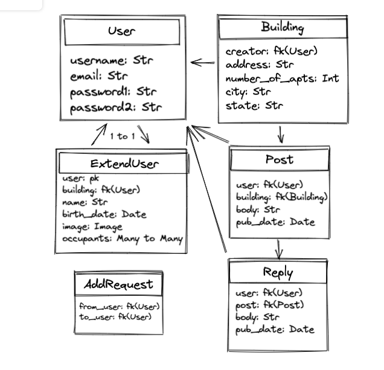
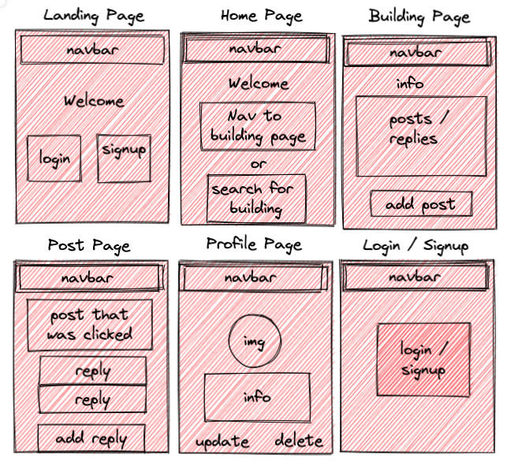

# neighborly
Neighborly is a closed social media application for users to be able to discuss building-wide issues with their neighbors without having to exchange phone numbers or add each other on social media. 

Users can request to join an already existing building page, or create one of their own. This page functions much like a message board, wherein the users can create posts which can be replied to by other occupants of the building. The add & request functionality ensures that people who do not live in the building will not have view access to the building's personal matters. Admin roles can be passed freely between users at any time, and users can leave and join new buildings at will (limited to one at a time).

## `Give it a Try`
* <a href="https://neighborly-application.herokuapp.com/">Link to the hosted site</a>
* Follow these installation instructions
    * fork and clone the repository
    * open in your favorite code editor
    * run pip3 install -r requirements.txt
    * run python3 manage.py runserver

## ERD

## Wireframe

